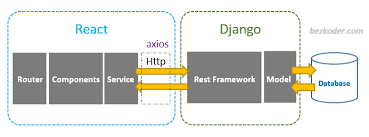

# Projet Shipex

Ce document présente notre plateforme innovante, une application web et mobile dédiée à l'optimisation logistique par la géolocalisation. Ce projet vise à simplifier et améliorer les processus de transport et de gestion des stocks dans l'industrie logistique. Notre objectif est de faciliter la gestion des itinéraires de transport de manière efficace, en offrant des fonctionnalités telles que le suivi en temps réel des livraisons, l'optimisation des itinéraires et la planification des horaires de livraison. Conçue pour aider les entreprises à réduire les coûts logistiques tout en améliorant l'efficacité des opérations, cette plateforme permet une gestion logistique optimisée grâce à des fonctionnalités avancées et une interface intuitive. Un élément clé de notre plateforme est l'intégration de Google Maps, qui aide à optimiser les trajets et à s'adapter aux besoins spécifiques de chaque entreprise, redéfinissant ainsi la logistique traditionnelle. En utilisant la technologie pour optimiser la logistique, nous visons non seulement à rendre les processus plus efficaces, mais aussi à répondre aux besoins uniques de chaque entreprise.
## Table des matières
- [Aperçu](#aperçu)
- [Frontend](#frontend)
- [Backend](#backend)
- [Pour commencer](#pour-commencer)
- [Utilisation](#utilisation)
- [Structure du dossier](#structure-du-dossier)
- [Dépendances](#dépendances)
- [Démo vidéo](#démo-vidéo)
- [Contributions](#contributions)
  ## Aperçu
 Le projet vise à créer une application de géolocalisation révolutionnaire pour simplifier la gestion logistique. Avec une interface conviviale et sécurisée, elle rend l'optimisation des itinéraires et la gestion des stocks accessibles à tous. En offrant des fonctionnalités comme le suivi en temps réel des livraisons et la sélection d'itinéraires basée sur les conditions de trafic, elle améliore l'efficacité opérationnelle et la satisfaction client. L'objectif principal est d'optimiser les processus logistiques et de réduire les coûts, tout en favorisant l'adoption continue de cette solution innovante.
- ## Architecture logicielle

## Frontend
### Technologies Utilisées
- React js
- React native 
- Chakra UI
- CSS
## Structure du Projet Frontend
La structure du projet frontend React repose sur quatre éléments essentiels, chacun ayant un objectif précis et contribuant à l'architecture globale et à la stabilité de l'application.
### 1. Composant Admin 
- **Objectif:** Le tableau de bord de la plateforme Admin vise à fournir une vue d'ensemble des statistiques des colis et à faciliter la gestion des colis, des livreurs et des clients.
-**Fonctionnalité:** Le tableau de bord de la plateforme offre une vue synthétique des statistiques des colis, distinguant les colis en attente des colis livrés et indiquant le nombre total de colis ajoutés chaque mois. Il facilite également la gestion des colis en permettant leur suppression, tout en simplifiant la gestion des utilisateurs grâce à des fonctionnalités d'ajout et de suppression rapides des livreurs et des clients existants.
### 2. Composant Auth/SingIn
- **Objectif:**  Faciliter l'authentification des utilisateurs avec une interface de connexion commune, tout en offrant des formulaires d'inscription distincts adaptés à chaque rôle.
-**Fonctionnalité:** L'application propose une authentification unifiée via une interface de connexion partagée pour tous les utilisateurs. Les formulaires d'inscription sont adaptés à chaque type d'utilisateur, facilitant la saisie des informations nécessaires à leur rôle respectif.
### 3. Composant Client 
- **Objectif:** Permettre aux clients de soumettre facilement un colis en fournissant des détails précis via un formulaire détaillé
- **Fonctionnalité:** La fonctionnalité de suivi des colis fournit aux clients des informations cruciales telles que la durée et le coût estimés de la livraison, le statut actuel du colis, l'acceptation du chauffeur pour la livraison, ainsi que des détails supplémentaires tels que le nom, la date d'expédition et le poids du colis.
 ### 4. Composant Livreur
-  **Objectif:** Offrir aux livreurs la flexibilité de sélectionner les villes à visiter dans l'ordre de leur choix tout en optimisant les itinéraires pour une efficacité maximale
- **Fonctionnalité:** Les livreurs peuvent personnaliser leurs itinéraires en choisissant les villes à visiter, tandis que l'application optimise leur trajet. Ils consultent les colis disponibles sur la carte et les acceptent ou les refusent. Une fois accepté, un colis est assigné au trajet du livreur, lui interdisant d'en accepter d'autres pendant 48 heures.
### Routing
- **React Router:** L'utilisation de React Router facilite la navigation entre les différents éléments de l'application, garantissant ainsi une expérience utilisateur fluide.

